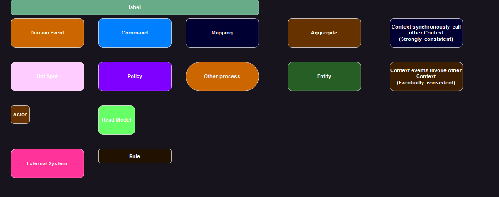
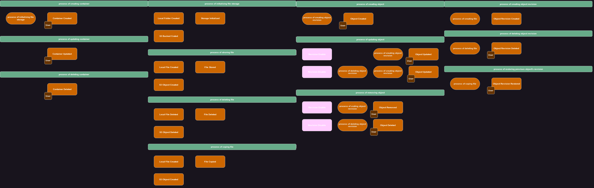
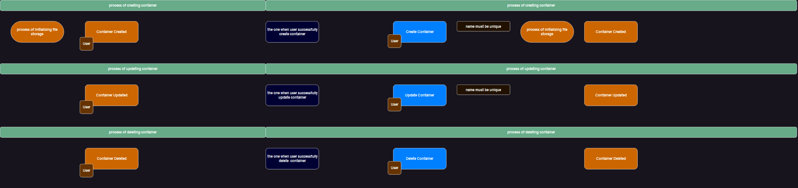
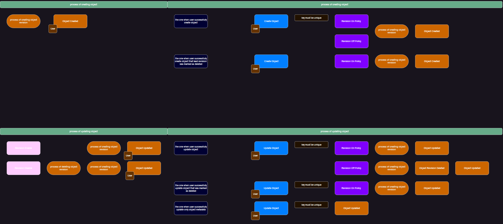
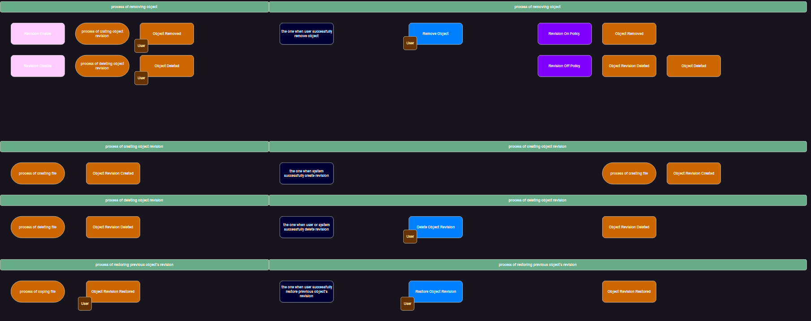
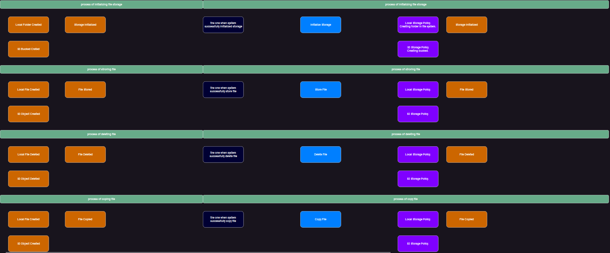

### System modeling
#### introduction
To model the domain, the DDD (Domain-Driven Design) approach was applied, complemented by Event Storming. Event Storming is an excellent tool for supporting DDD processes, particularly during the exploratory and design phases. It facilitates the identification of domain events, the modeling of business processes, and the development of a shared language among all stakeholders.

Event Storming is created using draw.io, and the corresponding file is located in the designated folder(`./f18.drawio`).
Below, an exported image of the documentation is provided for reference:

#### Domain Description
The File Storage System is designed to manage and store files along with their associated metadata. 
It consists of two primary entities: Containers and the Objects they contain.

A Container is a logical grouping of Objects and serves as the primary organizational unit in the system. 
Each container is:
- identified by a unique name 
- is assigned one of the following access types:
  - Public: All files within the container are accessible to anyone without requiring authentication.
  - Protected: Files are accessible only to authenticated actors. 
  - Private: Files are restricted to the container owner or users with specific authority.
- revision Policy:
  - REVISION_ON - revision enable
  - REVISION_OFF - revision disable

An Object represents a file stored in the system. Object consists of the following attributes:
- Key: Derived from the file name,
- Metadata: Includes additional information about the file, such as size, creation date, and custom attributes.

#### Strategic Design (ES: Pig Picture & Process Modeling)
During modeling, the following **definitions** were established as universal concepts, applicable across all bounded contexts within the domain:
- container - logical container for objects;
- object - represents a file stored in the system;

#### Legend:

#### ES. Pig Picture:

#### ES. Process Modeling:
- container related processes

- object related processes:

- storage related processes:

#### **Tactical Design (ES: Design Modeling)**

After documenting and describing the processes, the following **bounded contexts** were identified:

##### 1. container context
Implemented in Layered architectural patter as Active Record.

##### 2. object context
Implemented in Port & Adapters architectural patter as Domain Model.

##### 3. storage context
Implemented in Layered architectural patter as Transaction Script.